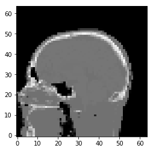

Demo 02: Sample data in TIGRE
=============================

To load the data (head phantom) for experiments, do as follows:

.. code:: ipython2

    # Define geometry
    import tigre
    geo = tigre.geometry(mode='cone',default=True,high_quality = False)

.. code:: ipython2

    from tigre.demos.Test_data.data_loader import load_head_phantom
    head = load_head_phantom(geo.nVoxel)
    tigre.plotimg(head,slice=32)

.. parsed-literal::

    <tigre.utilities.plotimg.plotimg instance at 0x7fe948fdaea8>
