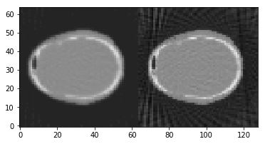

Demo 03: Simple Image reconstruction
====================================

This demo will show you a simple image reconstruction can be performed,
by using OS_SART and FDK.

Define geometry
---------------

.. code:: ipython2

    import tigre
    geo = tigre.geometry_default(high_quality=False)

Load data and generate projections
----------------------------------

.. code:: ipython2

    import numpy as np
    from tigre.Ax import Ax
    from tigre.demos.Test_data import data_loader
    # define angles
    angles=np.linspace(0,2*np.pi,dtype=np.float32)
    # load head phantom data
    head=data_loader.load_head_phantom(number_of_voxels=geo.nVoxel)
    # generate projections
    projections=Ax(head,geo,angles,'interpolated')

Reconstruct image using OS-SART and FDK
---------------------------------------

.. code:: ipython2

    # OS_SART
    niter=50
    imgOSSART=tigre.algorithms.ossart(projections,geo,angles,niter, **dict(blocksize=20))
    
    # FDK 
    imgfdk=tigre.algorithms.FDK(projections,geo,angles)
    
    # Show the results
    tigre.plotimg(np.hstack((imgOSSART,imgfdk)),slice=32,dim='x')

.. parsed-literal::

    OSSART algorithm in progress.
    Esitmated time until completetion (s): 20.519534

.. parsed-literal::

    <tigre.utilities.plotimg.plotimg instance at 0x7f726bd0b758>
