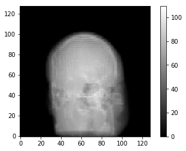
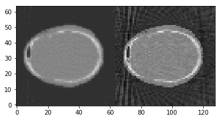

Demo 04: How to use plotting functions
======================================

This demo will demonstrate the options for plotting projections and
images on TIGRE. The functions have been in previous demos, but in here
an exaustive explanation and usage of them is given.

Define Geometry
---------------

.. code:: ipython2

    import tigre
    geo=tigre.geometry_default(high_quality=False)

Load data and generate projections
----------------------------------

.. code:: ipython2

    import numpy as np
    from tigre.utilities.Ax import Ax
    from Test_data import data_loader
    # define angles
    angles=np.linspace(0,2*np.pi,dtype=np.float32)
    # load head phantom data
    head=data_loader.load_head_phantom(number_of_voxels=geo.nVoxel)
    # generate projections
    projections=Ax(head,geo,angles,'interpolated')

Reconstruct image using OS-SART and FDK
---------------------------------------

.. code:: ipython2

    import tigre.algorithms as algs
    from tigre.utilities.plotImg import plotImg
    
    # OS_SART
    niter=50
    imgOSSART=algs.ossart(projections,geo,angles,niter)
    
    # FDK 
    imgfdk=algs.fdk(projections,geo,angles)

.. parsed-literal::

    OS_SART algorithm in progress.
    Esitmated time until completetion (s): 2.46085

.. parsed-literal::

    /home/aabhca20/Documents/TIGRE-python/Python/tigre_python_build/tigre/Utilities/filtering.py:56: UserWarning: no filter selected, using default ram_lak
      warnings.warn('no filter selected, using default ram_lak')

Let’s use plotproj
------------------

.. code:: ipython2

    # plotproj plots the projection measured on the detector on each angle. 
    
    from tigre.utilities.plotproj import plotproj 
    plotproj(projections)
    
    # another useful function is ppslice, which returns the projection at a single angle.
    # Default is at projections[len(angles)/2]
    
    from tigre.utilities.plotproj import ppslice
    ppslice(projections,slice=35)

what about plotImg?
-------------------

.. code:: ipython2

    # plotImg plots the final reconstruction of the 3D array. Dim defaults to z, but can be
    # changed accordingly
    from tigre.utilities.plotImg import plotImg
    # For more info on what parameters to use, type:
    help(plotImg)
    plotImg(np.hstack((imgOSSART,imgfdk)),slice=32)

.. parsed-literal::

    Help on class plotImg in module tigre.Utilities.plotImg:
    
    class plotImg
     |  plotImg(cube, dim) 
     |      plots figure 
     |  default: progressive in slices following
     |      axis (dim)
     |  Parameters 
     |  ---------- 
     |  cube : Any 3D numpy array 
     |  
     |  dim : ("X","Y","Z","x","y","z"), optional 
     |         default is "Z"
     |         NOTE: string arguments!
     |  slice: int, optional
     |       returns page of matrix according to index
     |  Examples:
     |  ---------
     |  a=np.ones([3,3,3])
     |  plotImg(a)
     |  >>>returns plot along dim Z
     |  plotImg(a,dim="X")
     |  >>>returns plot along dim X
     |  
     |  Methods defined here:
     |  
     |  __init__(self, cube, dim=None, slice=None)
     |  
     |  run(self)
     |  
     |  run_plot(self)
     |  
     |  slicer(self)
    

.. parsed-literal::

    <tigre.Utilities.plotImg.plotImg instance at 0x7f00e601ab48>

