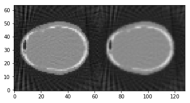
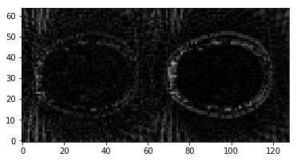

Demo 05: Algorithms01
=====================

This demo will demonstrate the options for plotting projections and images on TIGRE. The functions have been in previous demos, but in here an exaustive explanation and usage of them is given.

Define Geometry
---------------

.. code:: ipython2

    import tigre
    geo=tigre.geometry_default(high_quality=False)

Load data and generate projections
----------------------------------

.. code:: ipython2

    import numpy as np
    from tigre.utilities.Ax import Ax
    from tigre.demos.Test_data import data_loader
    # define angles
    angles=np.linspace(0,2*np.pi,dtype=np.float32)
    # load head phantom data
    head=data_loader.load_head_phantom(number_of_voxels=geo.nVoxel)
    # generate projections
    projections=Ax(head,geo,angles,'interpolated')

Usage of FDK
------------

.. code:: ipython2

    import tigre.algorithms as algs
    print(help(algs.fdk))

.. parsed-literal::

    Help on function FDK in module tigre.algorithms.single_pass_algorithms:
    
    FDK(proj, geo, angles, **kwargs)
          solves CT image reconstruction.
        
          :param proj: np.array(dtype=float32),
           Data input in the form of 3d
        
          :param geo: tigre.utilities.geometry.Geometry
           Geometry of detector and image (see examples/Demo code)
        
          :param angles: np.array(dtype=float32)
           Angles of projection, shape = (nangles,3) or (nangles,)
        
          :param filter: str
           Type of filter used for backprojection
           opts: "shep_logan"
                 "cosine"
                 "hamming"
                 "hann"
        
          :param verbose: bool
           Feedback print statements for algorithm progress
        
          :param kwargs: dict
           keyword arguments
        
          :return: np.array(dtype=float32)
        
          Usage:
          -------
          >>> import tigre
          >>> import tigre.algorithms as algs
          >>> import numpy
          >>> from tigre.demos.Test_data import data_loader
          >>> geo = tigre.geometry(mode='cone',default_geo=True,
          >>>                         nVoxel=np.array([64,64,64]))
          >>> angles = np.linspace(0,2*np.pi,100)
          >>> src_img = data_loader.load_head_phantom(geo.nVoxel)
          >>> proj = tigre.Ax(src_img,geo,angles)
          >>> output = algs.FDK(proj,geo,angles)
        
          tigre.demos.run() to launch ipython notebook file with examples.
        
        
          --------------------------------------------------------------------
          This file is part of the TIGRE Toolbox
        
          Copyright (c) 2015, University of Bath and
                              CERN-European Organization for Nuclear Research
                              All rights reserved.
        
          License:            Open Source under BSD.
                              See the full license at
                              https://github.com/CERN/TIGRE/license.txt
        
          Contact:            tigre.toolbox@gmail.com
          Codes:              https://github.com/CERN/TIGRE/
        ----------------------------------------------------------------------
          Coded by:          MATLAB (original code): Ander Biguri
                             PYTHON : Reuben Lindroos
    
    None

.. code:: ipython2

    
    imgfdk1=algs.FDK(projections,geo,angles,filter='ram_lak')
    imgfdk2=algs.FDK(projections,geo,angles,filter='hann')
    # The look quite similar:
    tigre.plotimg(np.hstack((imgfdk1,imgfdk2)),slice=32,dim='x')

.. parsed-literal::

    <tigre.utilities.plotimg.plotimg instance at 0x7f740ab0a560>

On the other hand it can be seen that one has bigger errors in the whole
image while the other just in the boundaries

.. code:: ipython2

    dif1=abs(head-imgfdk1)
    dif2=abs(head-imgfdk2)
    tigre.plotimg(np.hstack((dif1,dif2)),slice=32,dim='x')

.. parsed-literal::

    <tigre.utilities.plotimg.plotimg instance at 0x7f7401a845a8>

