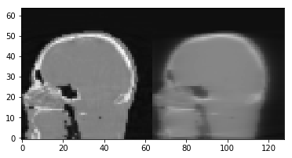
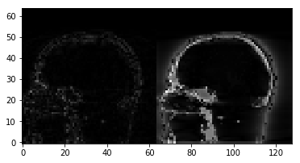

Demo 07: Algorithms 03. Krylov subspace
=======================================

In this demo the usage of the kylov subsapce family is explaines. This
family of algorithms iterate through the eigenvectors of the residual
(Ax-b) of the problems in descending order, achieving increased
convergence rates as compared to the SART family.

In cases where the data is good quality, SART type families tend to
reach a better image, but when the data gets very big, or has bad
qualily, CGLS is a good and fast algorithm.

Define geometry
---------------

.. code:: ipython2

    import tigre
    import numpy as np
    geo = tigre.geometry(mode='cone',default=True,high_quality=False)
    print(geo)

.. parsed-literal::

    TIGRE parameters
    -----
    Geometry parameters
    Distance from source to detector (DSD) = 1536 mm
    Distance from source to origin (DSO)= 1000 mm
    -----
    Detector parameters
    Number of pixels (nDetector) = [128 128]
    Size of each pixel (dDetector) = [3.2 3.2] mm
    Total size of the detector (sDetector) = [409.6 409.6] mm
    -----
    Image parameters
    Number of voxels (nVoxel) = [64 64 64]
    Total size of the image (sVoxel) = [256 256 256] mm
    Size of each voxel (dVoxel) = [4. 4. 4.] mm
    -----
    Offset correction parameters
    Offset of image from origin (offOrigin) = [0 0 0] mm
    Offset of detector (offDetector) = [0 0] mm
    -----
    Auxillary parameters
    Samples per pixel of forward projection (accuracy) = 0.5
    -----
    Rotation of the Detector (rotDetector) = [0 0 0] rad

Load data and generate projections
----------------------------------

.. code:: ipython2

    from tigre.demos.Test_data import data_loader
    angles = np.linspace(0,2*np.pi,100)
    head = data_loader.load_head_phantom(geo.nVoxel)
    projections = tigre.Ax(head,geo,angles,'interpolated')

Usage of CGLS
-------------

.. code:: ipython2

    #  CGLS has the common 4 inputs for iterative algorithms in TIGRE:
    #
    #  Projections, geometry, angles, and number of iterations 
    #
    # Additionally it contains optional initialization tehcniques, but we
    # reccomend not using them. CGLS is already quite fast and using them may
    # lead to divergence.
    # The options are:
    #  'Init'    Describes diferent initialization techniques.
    #             �  'none'     : Initializes the image to zeros (default)
    #             �  'FDK'      : intializes image to FDK reconstrucition
    import tigre.algorithms as algs
    imgCGLS = algs.cgls(projections,geo,angles,niter=20)
    imgSIRT = algs.sirt(projections,geo,angles,niter=20)

.. parsed-literal::

    CGLS Algorithm in progress.
    Esitmated time until completetion (s): 8.925535
    re-initilization of CGLS called at iteration:19
    Average time taken for each iteration for CGLS:0.1459274(s)
    SIRT algorithm in progress.
    Esitmated time until completetion (s): 4.546947

.. code:: ipython2

    output = np.hstack((imgCGLS,imgSIRT))
    tigre.plotimg(output,slice=32)

.. parsed-literal::

    <tigre.utilities.plotimg.plotimg instance at 0x7f3b0ea1fcf8>

.. code:: ipython2

    error = np.hstack((abs(imgCGLS-head), abs(imgSIRT-head)))
    tigre.plotimg(error,slice=32)

.. parsed-literal::

    <tigre.utilities.plotimg.plotimg instance at 0x7f3b03648c68>
