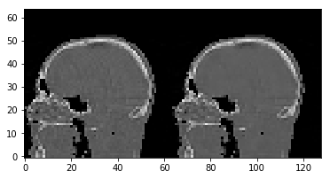

Demo 10: FISTA
==============

This demo shows how to make use of FISTA, another algorithm that makes
use of a tvminimisation step but also converges quadratically, almost as
fast as cgls.

Define geometry
---------------

.. code:: ipython2

    import tigre
    import numpy as np
    geo = tigre.geometry(mode='cone',default=True,high_quality=False)
    print(geo)

.. parsed-literal::

    TIGRE parameters
    -----
    Geometry parameters
    Distance from source to detector (DSD) = 1536 mm
    Distance from source to origin (DSO)= 1000 mm
    -----
    Detector parameters
    Number of pixels (nDetector) = [128 128]
    Size of each pixel (dDetector) = [3.2 3.2] mm
    Total size of the detector (sDetector) = [409.6 409.6] mm
    -----
    Image parameters
    Number of voxels (nVoxel) = [64 64 64]
    Total size of the image (sVoxel) = [256 256 256] mm
    Size of each voxel (dVoxel) = [4. 4. 4.] mm
    -----
    Offset correction parameters
    Offset of image from origin (offOrigin) = [0 0 0] mm
    Offset of detector (offDetector) = [0 0] mm
    -----
    Auxillary parameters
    Samples per pixel of forward projection (accuracy) = 0.5
    -----
    Rotation of the Detector (rotDetector) = [0 0 0] rad

Set up data
-----------

.. code:: ipython2

    from tigre.demos.Test_data import data_loader
    angles = np.linspace(0,2*np.pi,100)
    head = data_loader.load_head_phantom(geo.nVoxel)
    proj = tigre.Ax(head,geo,angles)

Lets set up CGLS and OSSART for comparison
------------------------------------------

.. code:: ipython2

    import tigre.algorithms as algs
    imgCGLS = algs.cgls(proj,geo,angles,niter=20)
    imgOSSART = algs.ossart(proj,geo,angles,niter=20)

.. parsed-literal::

    CGLS Algorithm in progress.
    Esitmated time until completetion (s): 9.700507
    Average time taken for each iteration for CGLS:0.15033015(s)
    OSSART algorithm in progress.
    Esitmated time until completetion (s): 11.98729

FISTA
-----

.. code:: ipython2

    # Of utmost importance to FISTA is the convergence constant, defined as the lipschitz
    # constant of the linear system Ax. In the algorithm it can be passed as the key word 
    # 'hyper'
    
    #     :keyword hyper: (np.float64)
    #         hyper parameter proportional to the largest eigenvalue of the
    #         matrix A in the equations Ax-b and ATb.
    #         Empirical tests show, for the headphantom object:
    
    #         nVoxel = np.array([64,64,64]),      hyper (approx=) 2.e6
    #         nVoxel = np.array([512,512,512]),   hyper (approx=) 2.e4
    
    # from tigre.utilities.power_method import svd_power_method
    
    imgFISTA = algs.fista(proj,geo,angles,niter=75,hyper = 2.e6)
    
    # tweeking the tv parameters for the algorithm 
    
    imgFISTA_hightv = algs.fista(proj,geo,angles,niter=75,hyper=2.e6,tviter=100,tvlambda=10)

.. parsed-literal::

    FISTA algorithm in progress.
    Esitmated time until completetion (s): 13.830748
    FISTA algorithm in progress.
    Esitmated time until completetion (s): 15.645154

Plot results
------------

.. code:: ipython2

    tigre.plotimg(np.hstack((imgCGLS,imgOSSART)),slice=32)

.. parsed-literal::

    <tigre.utilities.plotimg.plotimg instance at 0x7f69325157a0>

.. code:: ipython2

    tigre.plotimg(np.hstack((imgFISTA,imgFISTA_hightv)),slice=32)

.. parsed-literal::

    <tigre.utilities.plotimg.plotimg instance at 0x7f6968a56368>
